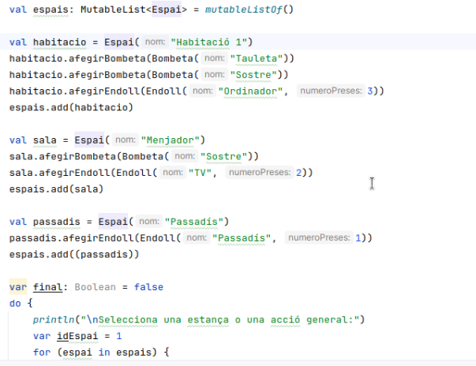

# Correcció Lampada Ali Babar
**.VALUES()**

### Funció llegirComanda() innecessària
No calia fer una funció per llegir les comandes, pots posar un else al `WHEN` i ja està.

El que he fet:
```kotlin
    do{
    comandaUsuari = llegirComanda(COMANDES)
    when(comandaUsuari){
        "TURN ON" -> LAMPADA.encendre()
        "TURN OFF" -> LAMPADA.apagar()
        "CHANGE COLOR" -> LAMPADA.canviarColor()
        "INTENSITY" -> LAMPADA.pujarIntensitat()
    }

    if(LAMPADA.encesa) println(LAMPADA)
    else{
        println("apagada")
    }

}while(comandaUsuari!="END")

fun llegirComanda(COMANDES: Array<String>):String{
    var dadaCorrecta: Boolean = false
    var comandaUsuari: String
    do{
        comandaUsuari= readln().uppercase()
        if(comandaUsuari in COMANDES) dadaCorrecta = true
        else{
            println(RED+"Comanda no reconeguda! Introdueix una comanda vàlida:"+ RESET)
            mostrarComandes(COMANDES,"Comandes: ")
        }
    }while(!dadaCorrecta)

    return comandaUsuari
}
```

Correcció:
```kotlin
var acabar: Boolean = false
    do{
    comandaUsuari = llegirComanda(COMANDES)
    when(comandaUsuari){
        "TURN ON" -> LAMPADA.encendre()
        "TURN OFF" -> LAMPADA.apagar()
        "CHANGE COLOR" -> LAMPADA.canviarColor()
        "INTENSITY" -> LAMPADA.pujarIntensitat()
        "END" -> acabar = true // afegir això tmb ...
        else -> println(RED+"Comanda no reconeguda! Introdueix una comanda vàlida:"+ RESET)
    }
    
    if(LAMPADA.encesa) println(LAMPADA)
    else{
        println("apagada")
    }
    
}while(!acabar) //i això
```


### Definició lampada David

```kotlin
class Lampada {
    var encesa: Boolean = false
    var intensitat: Int = 1
    var color: ColorBombeta = ColorBombeta.BLANC

    //Mètodes constructors
    constructor(encesa: Boolean, intensitat: Int, color: ColorBombeta) {
        this.encesa = encesa
        this.intensitat = intensitat
        this.color = color
    }
}
```

```kotlin
class Lampada {
    //atributs
    var encesa: Boolean
    var intensitat: Int
    var color: ColorBombeta

    //constructors
    constructor(encesa: Boolean = false, intensitat: Int = 1, color: ColorBombeta = ColorBombeta.WHITE) {
        this.encesa = encesa
        this.intensitat = intensitat
        this.color = color
    }
    
    //mètodes
}
```
> Fixa't en els comentaris que posa ell. I els valors per defecte no els posa als atributs, sinó al constructor.

## PRINT del estat a encendre()
Els print dels estats i d'"apagada" és millor que els posi directament en els mètodes i no en el main.

```kotlin
fun pujarIntensitat() {
    if(this.encesa) {
        if(this.intensitat<5){
            this.intensitat++
        }
        println(this) //mostro estat aquí
    } else {
        println("apagada") //imprimeixo apagada aquí
    }

}
```
> Això d'imprimir "apagada" i l'estat ho fem dintre de CADA mètode que ho requereixi (pujarIntensitat()...)

## ChangeColor()


## override ToString() al final
El David posa l'override del ToString() com a últim mètode